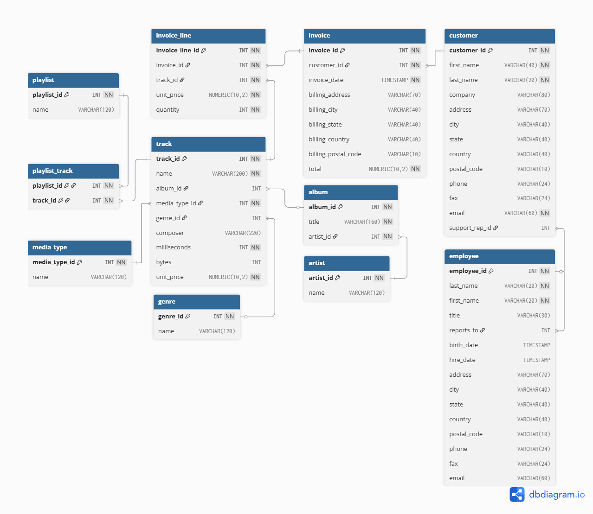

# HW15 - SQL Queries on Chinook Database

This project contains a set of SQL queries written to explore and analyze the **Chinook** database.  
Each task focuses on joining multiple tables, extracting meaningful relationships between entities, and presenting results in a clear and structured way.

## Task definition

1. Tracks with album and artist

    - Track name
    - Album title
    - Artist name

2. Invoice lines with track, invoice date, and customer

    - Invoice line ID
    - Invoice date
    - Track name
    - Unit price (from invoice line)
    - Quantity
    - Customer’s full name (combined first and last names)

3. Customers with their support representative (employee) sorted by full name of support representative and full name of customer

    - Customer ID
    - Customer’s full name (combined first and last names)
    - Support representative’s full name (combined first and last name
      s)

4. Playlist contents: playlist name with each track sorted by playlist name and track’s name

    - Playlist's name
    - Track’s name

5. Invoices with billing city sorted by invoice date in descending order and Invoice ID in ascending order

    - Invoice ID
    - Invoice date
    - Billing city
    - Total
    - Customer’s full name

6. Employees with no manager
    - Employee’s full name
    - Title
    - Birth Date (only date with no time)
    - Hire Date (only date with no time)

## 📝 Description

The goal of this homework assignment is to strengthen my SQL skills through practical work with a real relational schema.  
The Chinook database provides a clean and well-structured environment to practice JOINs, sorting, date formatting, and working with multi-entity relationships such as tracks, albums, artists, invoices, customers, employees, and playlists.

---

## 🎯 Purpose

Through this assignment, I aimed to improve my ability to:

-   Write SQL queries involving multiple JOINs
-   Extract composite fields such as full names
-   Format output for clarity (dates, sorted results, naming)
-   Understand how normalized tables connect in a production-like schema
-   Navigate real-world entity relationships between music catalog data and sales records

These are essential skills for backend engineering, analytics, and any data-driven development workflow.

---

## 🔍 How It Works

This project includes **six SQL queries**, each addressing a specific task in the Chinook environment:

### 1. Tracks with Album and Artist

Retrieves the track name together with its album and the performing artist.

### 2. Invoice Lines with Track Details and Customer

Shows individual invoice lines combined with the track name, invoice date, unit price, quantity,  
and the customer's full name.

### 3. Customers with Their Support Representatives

Lists customers along with their assigned employees, sorted by both employee and customer full names.

### 4. Playlist Contents

Displays playlists and the tracks they contain, sorted alphabetically.

### 5. Invoices with Billing City

Returns invoices including invoice date, billing city, total price,  
and full customer name, sorted by newest invoices first.

### 6. Employees with No Manager

Shows employees whose `reports_to` value is `NULL`, indicating they do not have a manager.

All queries use readable formatting and consistent naming conventions.

---

## 🗺️ ER Diagram (Chinook Database)

Below is an entity-relationship diagram describing the main tables used in this assignment.



## 📜 Output Example

Examples of results produced by these queries may include:

-   _Track: “Give Me Back My Bullets” — Album: “Give Me Back My Bullets” — Artist: “Lynyrd Skynyrd”_
-   _Invoice #312 on 2010-03-11 billed to Jane Peacock_
-   _Playlist “Rock” contains track “Back in Black”_
-   _Employee “Andrew Adams” has no manager_

Actual output varies depending on the dataset inside Chinook.

---

## 📦 Usage

1. Install PostgreSQL or use any PostgreSQL-compatible environment.
2. Import the Chinook database:

```bash
psql -U your_user -f chinook.sql
```

3. Run the SQL queries in:

    - psql
    - pgAdmin
    - DBeaver
    - DataGrip
    - Any SQL editor of your choice

All queries in this repository are fully compatible with PostgreSQL.

---

## ✅ Dependencies

-   PostgreSQL
-   Chinook PostgreSQL schema
-   Any SQL client

---

## 📊 Project Status

-   ✔️ Fully completed
-   ✔️ Tested against official Chinook sample database
-   ✔️ Clean and maintainable SQL code

---

## 📄 License

MIT License

---

## 🧮 Conclusion

This homework strengthened my practical understanding of relational databases, multi-table JOINs, and structured data extraction using the Chinook schema.
By implementing all six queries — from track and album relations to invoices, playlists, and employee hierarchy — I reinforced my ability to navigate normalized datasets and transform them into clean, meaningful results.

Working through this assignment helped me better understand entity relationships, sorting logic, date formatting, and the importance of readable, maintainable SQL.
These are essential skills for backend engineering and data-driven application development.

Great work — my SQL foundation just became stronger and more production-ready. 🚀

---

Made with ❤️ and `SQL` by **Sam-Shepsl Malikin** 🎓
